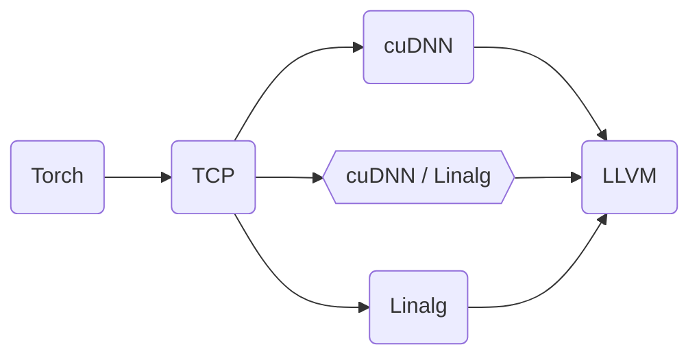

# Compiler-cuDNN integration from first principles

Traditionally deep learning compilers could implement convolutions on NVIDIA
GPUs in one of two ways: code generation or calls to libraries like cuDNN.
Compilers had to choose to either use code generation and enable bespoke fusion
but without leveraging the engineering work that has gone into cuDNN, or only
utilize the limited fusion opportunities exposed by cuDNN but use the highly
optimized kernels.

cuDNN 8.0 changed all that by introducing a "Graph API".

The cuDNN Graph API provides a declarative programming model for describing and
executing a graph of operations. Unlike the fixed set of fusion patterns the
legacy cuDNN APIs provided, these graphs can represent bespoke fusions.

In our [GTC talk](https://www.nvidia.com/gtc/session-catalog/#/session/1666649153910001zb6Z),
we introduced a clean integration of the cuDNN graph API as an
[MLIR](https://mlir.llvm.org/) dialect and a lowering from the Tensor Compute
Primitives (TCP) dialect to this cuDNN dialect. We show an end-to-end flow of
our conception of a first-class compiler integration with this API.

Through this integration, we blur the line between compilers and libraries and
enable compilers to benefit from the optimized kernels in cuDNN without giving
up on fusion.

# Pointers to code

* cuDNN dialect is being [incubated in the OpenXLA project](https://github.com/iree-org/iree-samples/cudnn-dialect)
and we are developing towards graduating.

* TCP is being developed in the
[mlir-tcp](https://github.com/llvm/torch-mlir/tree/mlir-tcp) branch of
TorchMLIR. Some of the updates to lower to cuDNN are yet to land in this
branch.

# Current status

We have an MLIR pipeline that performs the following lowering:



The runtime part needed to execute cuDNN is being actively worked on.

Here we show an example of the kind of cuDNN integration that we can do with
this work. Lets start with the following ops from resnet18:

```mlir
%109 = torch.aten.relu %108
        : !torch.vtensor<[1,64,56,56],f32> -> !torch.vtensor<[1,64,56,56],f32>
%110 = torch.aten.convolution %109, %88, %none, %101, %101, %101, %false, %102, %int1
        : !torch.vtensor<[1,64,56,56],f32>, !torch.vtensor<[64,64,3,3],f32>, !torch.none,
          !torch.list<int>, !torch.list<int>, !torch.list<int>, !torch.bool, !torch.list<int>,
          !torch.int -> !torch.vtensor<[1,64,56,56],f32>
```

They get lowered to the following TCP ops

```mlir
%139 = tcp.clamp %138 {min_float = 0.000000e+00 : f32}
        : tensor<1x64x56x56xf32> -> tensor<1x64x56x56xf32>
%140 = tcp.conv2d %139, %110 
        {dilation = array<i64: 1, 1>, pad = array<i64: 1, 1, 1, 1>, stride = array<i64: 1, 1>}
        : tensor<1x64x56x56xf32>, tensor<64x64x3x3xf32> -> tensor<1x64x56x56xf32>
```

These ops are then fused into a group in TCP with fusion specifically to target cuDNN

```mlir
%40 = tcp.isolated_group %39, %15 {
^bb0(%arg1: tensor<1x64x56x56xf32>, %arg2: tensor<64x64x3x3xf32>):
    %171 = tcp.clamp %arg1 {min_float = 0.000000e+00 : f32}
            : tensor<1x64x56x56xf32> -> tensor<1x64x56x56xf32>
    %172 = tcp.conv2d %171, %arg2
            {dilation = array<i64: 1, 1>, pad = array<i64: 1, 1, 1, 1>, stride = array<i64: 1, 1>}
            : tensor<1x64x56x56xf32>, tensor<64x64x3x3xf32> -> tensor<1x64x56x56xf32>
    tcp.yield %172 : tensor<1x64x56x56xf32>
} : tensor<1x64x56x56xf32>, tensor<64x64x3x3xf32> -> tensor<1x64x56x56xf32>
```

The group can then be lowered to the cuDNN dialect

```mlir
%40 = cudnn.get_current_handle !cudnn.handle
%41 = cudnn.build_and_exec_graph %40 %39, %15 {
^bb0(%arg1: !cudnn.tensor_desc<1x64x56x56xf32, alignment = 1, stride = []>,
     %arg2: !cudnn.tensor_desc<64x64x3x3xf32, alignment = 1, stride = []>):
    %179 = cudnn.pointwise_relu(%arg1) type = f32 lower_clip = 0.000000e+00
            : !cudnn.tensor_desc<1x64x56x56xf32, alignment = 1, stride = []>
            -> !cudnn.tensor_desc<1x64x56x56xf32, alignment = 1, stride = []>
    %180 = cudnn.convolution(%179, %arg2)
            type = f32 alpha = 1.000000e+00 beta = 0.000000e+00 spatial_dim_count = 4
            spatial_stride = [1, 1] pre_padding = [1, 1] post_padding = [1, 1]
            dilation = [1, 1]
            : !cudnn.tensor_desc<1x64x56x56xf32, alignment = 1, stride = []>,
              !cudnn.tensor_desc<64x64x3x3xf32, alignment = 1, stride = []>
            -> !cudnn.tensor_desc<1x64x56x56xf32, alignment = 1, stride = []>
    cudnn.build_graph(%180) : !cudnn.tensor_desc<1x64x56x56xf32, alignment = 1, stride = []>
} : tensor<1x64x56x56xf32>, tensor<64x64x3x3xf32> -> tensor<1x64x56x56xf32>
```

From the cuDNN dialect the lowering in development here lowers to a function
in LLVM dialect that, given a `cudnnHandle_t` returns a finalized operation
graph descriptor using the cuDNN backend API. Further orchestration to
integrate with backend (finding execution plan, allocation workspace &
executing) is not included yet as part of this lowering.

The interface between the compiled code (commonly by way of LinAlg) and cuDNN
dialect is via MLIR Memref API and consistent bufferization/layout
transformations to required in memory representation.

# Communication channels

This project is under active development and we welcome contributions and
discussion.

* Discord for [cuDNN](https://discord.gg/HeGBk8Jk) dialect
* Discord for [TCP](https://discord.gg/DjwgYMnj) dialect
