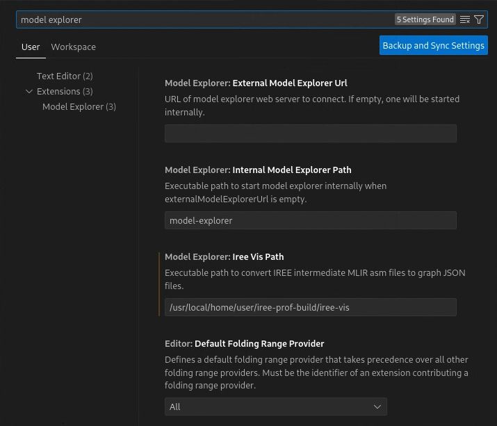

# Model Explorer in VS Code

Model explorer is a web tool to visualize ML models. This extension is to embed
model explorer within VS Code.

## How to run it

[Model explorer](https://github.com/google-ai-edge/model-explorer) must be
installed before this extension get started. Please follow the
[instruction](https://github.com/google-ai-edge/model-explorer/wiki/1.-Installation)
to install it.

This extension is started by executing `Explore Model: Start` command from the
Command Palette on a VS code active text editor of a graph json file. The
extension loads the file of the current focused editor to the model explorer
web server. If the model explorer is not running, it starts one with a random
port number in a terminal.

Currently, it supports Tensorflow saved_model.pb files, TFLite files, StableHLO
MLIR files, IREE MLIR files, and graph json files. For IREE MLIR files, it
requires `iree-vis` to convert them into graph json files.

```
cd <iree-experimental-root>/iree-prof-tools/
cmake -G Ninja -B ../../iree-prof-build/ .
cmake --build ../../iree-prof-build/ --target iree-vis
```

Once `iree-vis` is built, set its path in `ModelExplorer: Iree Vis Path`
setting.



The model explorer interacts with the editor of the original model file. When a
node is clicked on the model explorer, corresponding areas in the original
model file are highlighted.

From a position or a selected area in the oringal model file, executing
`Explore Model: Focus` command from the Command Palette moves the focus on a
corresponding node in the model explorer.

## How to make changes into it

To make changes of this extension, VS Code, Node.js and typescript compiler are
necessary. Please follow installation guides of
[VS Code](https://code.visualstudio.com/docs/setup/setup-overview) and
[Node.js](https://nodejs.org/en/download).

Then, install typescript compiler under the extension directory.

```
cd <iree-experimental-root>/iree-prof-tools/model-explorer-extension
npm install
code .
```

Once the workspace is open, follow the
[steps to build webview extensions](https://code.visualstudio.com/api/extension-guides/webview).
